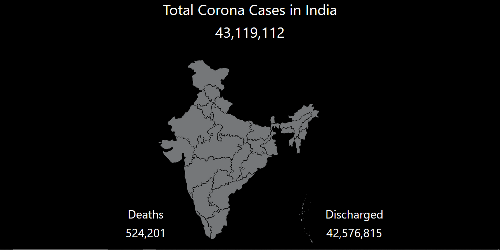

# Corona Case Tracker API

A simple web application to track COVID-19 cases in India, with an interactive map and animated counters for total cases, deaths, and discharged patients.

## Features
- Animated counters for total cases, deaths, and discharged
- Interactive India map with state-wise tooltips
- Responsive and modern UI using Bootstrap
- Real-time data fetched from [Rootnet COVID-19 India API](https://api.rootnet.in/covid19-in/stats/latest)

## Live Demo
[https://corona-case-tracker-api.vercel.app/](https://corona-case-tracker-api.vercel.app/)

## How to Use
1. Open the live demo link above.
2. View total, deaths, and discharged counters at the top.
3. Hover over states on the map to see state-wise COVID-19 statistics.

## Project Structure
- `index.html` – Main HTML file
- `assets/` – Contains CSS and map image
- `scripts/` – JavaScript logic for fetching data and UI interactivity

## Data Source
Data is fetched from the [Rootnet COVID-19 India API](https://api.rootnet.in/covid19-in/stats/latest).

## License
This project is for educational/demo purposes only.
